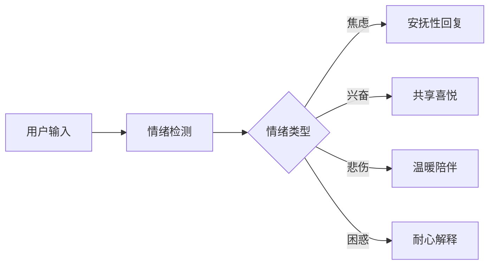

# 📱 Purple星语 - AI增强系统产品需求文档 (PRD)

> 版本：v1.0
> 更新日期：2025-01-10
> 文档类型：产品需求
> 产品经理：[待定]

## 📋 目录

1. [产品概述](#产品概述)
2. [用户研究](#用户研究)
3. [功能需求](#功能需求)
4. [用户体验设计](#用户体验设计)
5. [数据需求](#数据需求)
6. [商业模式](#商业模式)
7. [成功指标](#成功指标)
8. [风险评估](#风险评估)

---

## 一、产品概述

### 1.1 产品定位

**Purple星语增强版AI**是一个基于紫微斗数的智能对话系统，通过情绪识别、场景管理和长期记忆能力，为用户提供**有温度、个性化、专业化**的命理咨询服务。

### 1.2 产品愿景

> "让每个人都拥有一位懂你、记得你、陪伴你的专属命理导师"

### 1.3 核心价值主张

| 价值维度 | 标准版 | 增强版 | 用户收益 |
|---------|--------|--------|----------|
| **情感价值** | 机械回答 | 情感共鸣 | 感受到被理解和关怀 |
| **专业价值** | 通用解答 | 场景化专业指导 | 获得针对性建议 |
| **体验价值** | 无状态对话 | 持续性陪伴 | 建立长期信任关系 |
| **便利价值** | 单一入口 | 多场景适配 | 一站式解决需求 |

---

## 二、用户研究

### 2.1 目标用户画像

#### 👤 主要用户群体

**1. 迷茫探索者（35%）**
- 年龄：22-30岁
- 特征：人生转折期，需要方向指引
- 需求：事业规划、感情抉择、人生方向
- 痛点：缺乏倾诉对象，决策困难

**2. 命理爱好者（30%）**
- 年龄：25-40岁
- 特征：对命理文化感兴趣，有一定了解
- 需求：深度解盘、专业知识、运势分析
- 痛点：缺乏专业指导，信息碎片化

**3. 情感寻求者（20%）**
- 年龄：20-35岁
- 特征：感情困扰，需要情感支持
- 需求：感情分析、缘分解读、关系建议
- 痛点：隐私顾虑，需要安全倾诉空间

**4. 日常用户（15%）**
- 年龄：18-50岁
- 特征：轻度使用，偶尔查看
- 需求：每日运势、择日择时、趋吉避凶
- 痛点：功能单一，缺乏持续价值

### 2.2 用户旅程地图

```
发现 → 尝试 → 理解 → 信任 → 依赖 → 推荐
  ↓      ↓      ↓      ↓      ↓      ↓
好奇   惊喜   认同   习惯   情感   口碑
  ↓      ↓      ↓      ↓      ↓      ↓
[标准] [增强] [个性] [记忆] [陪伴] [分享]
```

### 2.3 用户需求分析

| 需求层次 | 具体需求 | 增强版解决方案 |
|---------|---------|---------------|
| **功能需求** | 准确的命理解答 | 专业知识库 + 场景化回答 |
| **情感需求** | 被理解和共鸣 | 情绪识别 + 共情回应 |
| **社交需求** | 安全的倾诉空间 | 隐私保护 + 持续陪伴 |
| **尊重需求** | 个性化体验 | 记忆系统 + 定制化服务 |
| **自我实现** | 人生指导 | 长期规划 + 成长追踪 |

---

## 三、功能需求

### 3.1 核心功能模块

#### 🎭 情绪识别系统

**功能描述**
- 识别用户的7种基础情绪状态
- 根据情绪调整回复语气和内容
- 危机情绪（如绝望）优先处理

**用户故事**
```
作为一个焦虑的用户
我希望AI能察觉到我的情绪
以便获得更贴心的安慰和建议
```

**交互流程**


**验收标准**
- [ ] 情绪识别准确率 > 85%
- [ ] 响应时间 < 500ms
- [ ] 支持中文语境
- [ ] 可处理复合情绪

#### 🎬 场景管理系统

**功能描述**
- 自动识别6种对话场景
- 动态调整专业度和语气
- 场景间平滑切换

**场景定义**

| 场景 | 触发条件 | AI表现 | 重点功能 |
|-----|---------|--------|---------|
| **问候** | 初次对话/打招呼 | 温暖友好 | 自我介绍、引导探索 |
| **解盘** | 查看命盘/星耀 | 专业严谨 | 深度分析、术语解释 |
| **运势** | 询问运程/时间 | 预测导向 | 时间节点、具体建议 |
| **学习** | 问"什么是"/"如何" | 循序渐进 | 知识传授、举例说明 |
| **咨询** | 人生抉择/困惑 | 共情理解 | 多角度分析、决策支持 |
| **紧急** | 情绪崩溃/危机 | 优先关怀 | 情感支持、资源推荐 |

**场景切换规则**
1. 关键词优先级：紧急 > 咨询 > 解盘 > 运势 > 学习 > 问候
2. 上下文延续：保持2-3轮对话的场景一致性
3. 自然过渡：使用过渡语句连接不同场景

#### 🧠 记忆系统

**功能描述**
- 记住用户的重要信息和偏好
- 跨会话保持上下文
- 个性化推荐和提醒

**记忆类型**

```swift
长期记忆（永久保存）
├── 基本信息：姓名、生日、性别
├── 命盘数据：主星、格局
└── 重要事件：关键日期、人生大事

中期记忆（30天）
├── 关注焦点：最近关心的话题
├── 咨询历史：问题和建议
└── 情绪模式：情绪变化趋势

短期记忆（7天）
├── 对话上下文：最近对话
├── 临时偏好：当前兴趣
└── 待办事项：用户提到的计划
```

**隐私设计**
- 用户可查看所有记忆内容
- 支持选择性删除记忆
- 记忆数据加密存储
- 明确告知记忆使用场景

#### 💡 智能推荐系统

**功能描述**
- 根据上下文推荐相关问题
- 基于用户历史推荐内容
- 主动提供有价值信息

**推荐策略**

| 推荐类型 | 触发时机 | 推荐内容 |
|---------|---------|---------|
| **问题推荐** | 对话结束 | 3-4个相关问题 |
| **功能推荐** | 使用场景 | 相关功能入口 |
| **内容推荐** | 浏览行为 | 相关知识文章 |
| **时机推荐** | 特定日期 | 择日建议 |

### 3.2 增强功能

#### 🎯 主动服务

**运势提醒**
- 重要日期提醒（大运交替、流年更替）
- 每日幸运时刻推送
- 特殊天象提醒

**关怀问候**
- 节日祝福
- 天气关怀
- 情绪关注

#### 📊 数据洞察

**个人报告**
- 月度情绪报告
- 关注焦点分析
- 成长轨迹记录

**运势分析**
- 运势趋势图
- 关键时间节点
- 决策建议

### 3.3 功能优先级

| 优先级 | 功能 | 价值 | 难度 | 说明 |
|-------|------|------|------|------|
| P0 | 情绪识别 | ⭐⭐⭐⭐⭐ | ⭐⭐ | 核心差异化功能 |
| P0 | 场景管理 | ⭐⭐⭐⭐⭐ | ⭐⭐⭐ | 专业度体现 |
| P0 | 基础记忆 | ⭐⭐⭐⭐ | ⭐⭐ | 个性化基础 |
| P1 | 云端同步 | ⭐⭐⭐⭐ | ⭐⭐⭐ | 跨设备体验 |
| P1 | 智能推荐 | ⭐⭐⭐ | ⭐⭐ | 提升互动 |
| P2 | 主动服务 | ⭐⭐⭐ | ⭐⭐⭐⭐ | 增值服务 |
| P2 | 数据洞察 | ⭐⭐ | ⭐⭐⭐ | 长期价值 |

---

## 四、用户体验设计

### 4.1 交互设计原则

1. **情感化设计**
   - 使用温暖的颜色和动画
   - 添加表情和语气词
   - 回复速度模拟真人思考

2. **简约不简单**
   - 主界面保持简洁
   - 高级功能逐步展现
   - 避免信息过载

3. **及时反馈**
   - 情绪识别可视化
   - 场景切换提示
   - 加载状态明确

### 4.2 界面设计规范

#### 对话界面增强

```
┌─────────────────────────┐
│  💬 星语助手  [增强版]    │  <- 模式标识
├─────────────────────────┤
│  当前：解盘中 · 平静     │  <- 场景和情绪
├─────────────────────────┤
│                         │
│  [对话内容区域]          │
│                         │
├─────────────────────────┤
│  推荐问题：              │
│  [?] [?] [?] [?]        │  <- 智能推荐
├─────────────────────────┤
│  [输入框] [发送]         │
└─────────────────────────┘
```

#### 情绪状态显示

- 🌈 兴奋 - 彩虹渐变
- 😰 焦虑 - 蓝色波动
- 😢 悲伤 - 灰蓝色调
- 😡 愤怒 - 红色脉动
- 🤔 困惑 - 问号动画
- 😊 平静 - 淡紫色

#### 场景标识设计

- 📖 学习中 - 书本图标
- 🔮 解盘中 - 水晶球
- 📅 看运势 - 日历
- 💭 咨询中 - 对话泡
- 🤝 问候中 - 握手
- 🆘 紧急支持 - 红色标记

### 4.3 文案设计

#### 情绪化文案示例

**焦虑情绪回应**
```
开场："我感受到你内心的不安，深呼吸，让我们一起理清思路..."
结尾："记住，焦虑是暂时的，而你的力量是永恒的。"
```

**兴奋情绪回应**
```
开场："你的喜悦感染了我！让我们看看这份好运会如何延续..."
结尾："保持这份美好的心情，好运会一直伴随着你～"
```

#### 场景化文案

**解盘场景**
```
"让我仔细看看你的命盘...紫微星坐命宫，这是帝王之星，
代表着你天生具有领导才能和高贵气质..."
```

**学习场景**
```
"很好的问题！紫微斗数中的'四化'是指化禄、化权、
化科、化忌，让我用简单的例子来解释..."
```

### 4.4 动效设计

| 场景 | 动效 | 作用 |
|-----|------|------|
| 情绪识别 | 颜色渐变 | 状态反馈 |
| 场景切换 | 淡入淡出 | 平滑过渡 |
| 加载等待 | 星光闪烁 | 减少焦虑 |
| 推荐展示 | 卡片滑入 | 吸引注意 |
| 记忆保存 | 光晕扩散 | 操作确认 |

---

## 五、数据需求

### 5.1 数据采集

#### 必要数据

| 数据类型 | 采集内容 | 用途 | 隐私级别 |
|---------|---------|------|----------|
| 对话数据 | 消息内容、时间戳 | 上下文理解 | 高 |
| 情绪数据 | 情绪类型、强度 | 个性化回复 | 中 |
| 场景数据 | 场景类型、切换 | 优化识别 | 低 |
| 行为数据 | 使用频率、时长 | 产品优化 | 低 |
| 反馈数据 | 评分、建议 | 质量提升 | 中 |

#### 数据使用原则
1. 最小化原则：只采集必要数据
2. 透明化原则：明确告知用途
3. 可控性原则：用户可删除数据
4. 安全性原则：加密存储传输

### 5.2 数据分析

#### 关键指标

**用户行为指标**
- DAU/MAU（日活/月活）
- 平均会话时长
- 消息数/会话
- 功能使用率

**AI质量指标**
- 情绪识别准确率
- 场景切换准确率
- 用户满意度评分
- 回复相关性评分

**商业指标**
- 免费->付费转化率
- 用户生命周期价值
- 客户获取成本
- 留存率曲线

### 5.3 数据安全

```
数据安全架构
├── 传输安全
│   ├── HTTPS加密
│   └── Certificate Pinning
├── 存储安全
│   ├── AES-256加密
│   └── 密钥分离存储
├── 访问控制
│   ├── Row Level Security
│   └── OAuth 2.0认证
└── 合规要求
    ├── GDPR合规
    └── 个人信息保护法
```

---

## 六、商业模式

### 6.1 订阅模式设计

| 套餐 | 月费 | 功能权益 | 目标用户 |
|-----|------|---------|----------|
| **免费版** | ¥0 | • 标准AI对话<br>• 每日20次<br>• 基础功能 | 轻度用户 |
| **基础版** | ¥19 | • 增强AI对话<br>• 每日100次<br>• 情绪识别<br>• 场景管理 | 普通用户 |
| **专业版** | ¥49 | • 无限对话<br>• 完整记忆<br>• 云端同步<br>• 优先响应 | 重度用户 |
| **大师版** | ¥99 | • 所有功能<br>• 1对1咨询<br>• 定制服务<br>• API接口 | 专业用户 |

### 6.2 增值服务

**单次购买**
- 详细命盘报告 ¥29
- 年度运势报告 ¥49  
- 感情合盘分析 ¥39
- 择日择时服务 ¥19

**增值包**
- 情感陪伴包 ¥9.9/月
- 事业顾问包 ¥19.9/月
- 学习进阶包 ¥14.9/月

### 6.3 变现路径

```
用户获取 → 免费体验 → 价值认知 → 付费转化 → 持续订阅
   ↓          ↓          ↓          ↓          ↓
 社交传播   功能限制   增强体验   订阅优惠   增值服务
```

### 6.4 定价策略

1. **心理定价**：19/49/99符合用户心理预期
2. **阶梯定价**：引导用户逐步升级
3. **捆绑销售**：套餐比单买优惠30%
4. **限时优惠**：首月5折，年付8折

---

## 七、成功指标

### 7.1 北极星指标

**用户价值指标：月度活跃用户满意度（MAUS）**
- 定义：月活用户中满意度≥4分的比例
- 目标：6个月内达到75%
- 计算：(满意用户数/MAU) × 100%

### 7.2 OKR设置

**Q1目标**
- O1: 提升用户体验满意度
  - KR1: NPS净推荐值 > 50
  - KR2: 用户满意度 > 4.5/5
  - KR3: 客诉率 < 1%

- O2: 实现商业增长
  - KR1: 付费用户数 > 10,000
  - KR2: MRR月度经常性收入 > ¥200,000
  - KR3: 付费转化率 > 5%

### 7.3 阶段性里程碑

| 阶段 | 时间 | 关键指标 | 成功标准 |
|-----|------|---------|---------|
| MVP | Month 1 | 核心功能上线 | 无重大bug |
| Growth | Month 3 | 用户增长 | MAU > 50k |
| Revenue | Month 6 | 商业验证 | MRR > 200k |
| Scale | Month 12 | 规模化 | MAU > 500k |

---

## 八、风险评估

### 8.1 风险矩阵

| 风险类型 | 可能性 | 影响度 | 缓解措施 |
|---------|--------|--------|---------|
| **技术风险** |  |  |  |
| API限流 | 高 | 高 | 多供应商备份 + 本地缓存 |
| 数据泄露 | 低 | 极高 | 加密 + 审计 + 保险 |
| 服务宕机 | 中 | 高 | 降级方案 + 离线模式 |
| **产品风险** |  |  |  |
| 用户不买单 | 中 | 高 | MVP验证 + 快速迭代 |
| 竞品抄袭 | 高 | 中 | 技术壁垒 + 品牌建设 |
| **运营风险** |  |  |  |
| 内容合规 | 中 | 高 | 审核机制 + 免责声明 |
| 用户流失 | 中 | 中 | 留存策略 + 会员体系 |
| **市场风险** |  |  |  |
| 政策变化 | 低 | 高 | 合规经营 + 多元化 |
| 市场饱和 | 低 | 中 | 差异化 + 出海策略 |

### 8.2 应急预案

**技术故障应急**
1. 一键切换到标准版
2. 启用离线缓存模式
3. 多云备份自动切换
4. 用户补偿机制

**PR危机处理**
1. 24小时响应机制
2. 官方声明模板
3. 用户安抚方案
4. 媒体沟通预案

---

## 九、实施计划

### 9.1 开发排期

```gantt
    title AI增强系统开发计划
    dateFormat  YYYY-MM-DD
    section 基础功能
    情绪识别系统    :done,    des1, 2025-01-01, 7d
    场景管理系统    :done,    des2, 2025-01-08, 7d
    记忆系统        :active,  des3, 2025-01-15, 10d
    section 云端集成
    Supabase集成    :         des4, 2025-01-25, 14d
    数据同步        :         des5, 2025-02-08, 7d
    section 商业化
    订阅系统        :         des6, 2025-02-15, 10d
    支付集成        :         des7, 2025-02-25, 7d
```

### 9.2 团队配置

| 角色 | 人数 | 职责 |
|-----|------|------|
| 产品经理 | 1 | 需求管理、协调推进 |
| iOS开发 | 2 | 客户端开发 |
| 后端开发 | 1 | API、数据库 |
| AI工程师 | 1 | 模型优化、Prompt工程 |
| UI设计师 | 1 | 界面、交互设计 |
| 测试工程师 | 1 | 质量保证 |
| 运营 | 1 | 用户增长、内容运营 |

### 9.3 预算估算

| 项目 | 月度成本 | 说明 |
|-----|---------|------|
| 人力成本 | ¥140,000 | 7人团队 |
| 服务器 | ¥10,000 | Supabase + Vercel |
| API费用 | ¥20,000 | AI接口调用 |
| 营销推广 | ¥30,000 | 用户获取 |
| **合计** | **¥200,000** | 月度运营成本 |

---

## 十、附录

### A. 竞品分析

| 产品 | 优势 | 劣势 | 我们的机会 |
|-----|------|------|-----------|
| 测测 | 用户基数大 | 功能繁杂 | 专注专业 |
| 准了 | 内容丰富 | 体验一般 | 智能交互 |
| AI算命 | 技术先进 | 缺少温度 | 情感连接 |

### B. 用户调研数据
- 调研样本：500+用户
- 满意度：4.2/5
- 主要诉求：个性化(42%)、专业性(31%)、情感支持(27%)

### C. 参考资料
- 《对话式AI设计最佳实践》
- 《情感计算与人机交互》
- 《产品心理学》

---

## 文档变更记录

| 版本 | 日期 | 变更内容 | 负责人 |
|-----|------|---------|--------|
| v1.0 | 2025-01-10 | 初始版本 | System |

---

*本文档为Purple星语AI增强系统的产品需求说明，将根据实际开发情况持续更新。*

*如有疑问，请联系产品团队。*