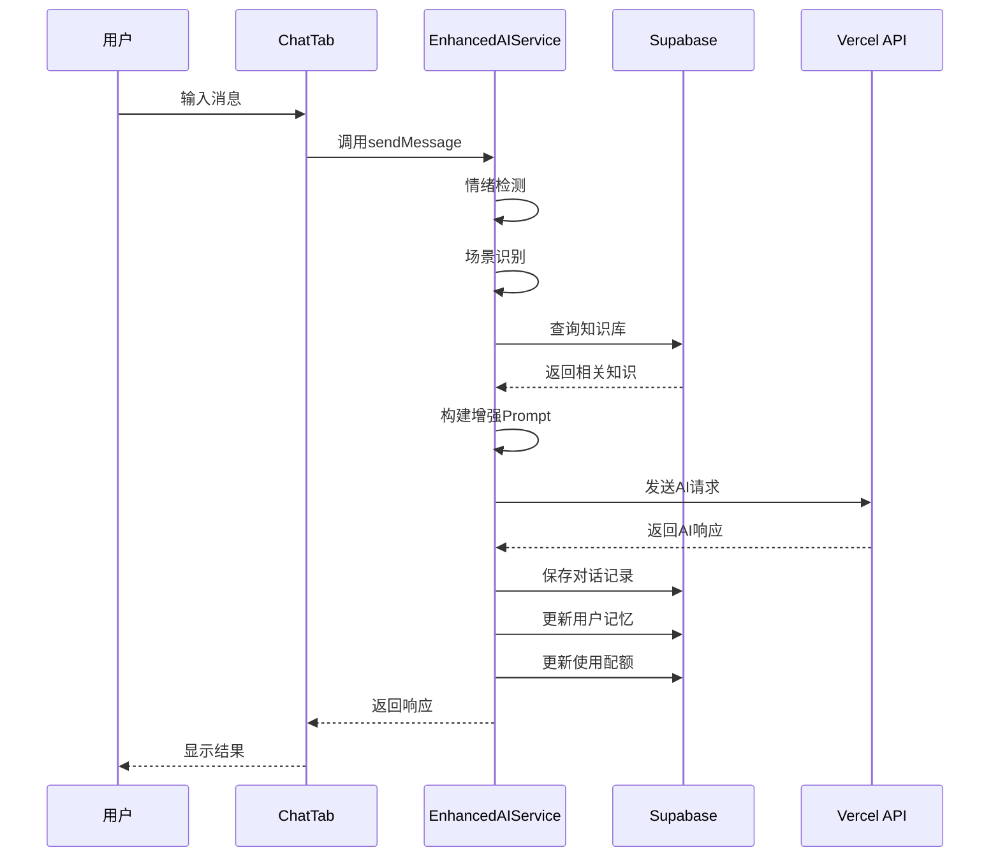

# 🏗️ Purple星语 - AI增强系统总体架构文档

> 版本：v1.0
> 更新日期：2025-01-10
> 文档类型：架构总览

## 📋 目录

1. [项目背景](#项目背景)
2. [系统架构](#系统架构)
3. [核心能力](#核心能力)
4. [数据库设计](#数据库设计)
5. [集成方案](#集成方案)
6. [关键决策](#关键决策)

---

## 一、项目背景

### 1.1 现状分析

**当前实现**
- ✅ 基础AI对话功能（AIService.swift）
- ✅ 简单的角色设定（星语导师）
- ✅ 基础对话历史管理
- ✅ Vercel AI Gateway集成

**存在问题**
- ❌ 缺乏情感共鸣能力
- ❌ 无法记住用户偏好
- ❌ 对话场景单一
- ❌ 无云端同步能力

### 1.2 升级目标

构建一个**有温度、有记忆、懂场景**的智能命理AI系统，通过情绪识别、场景管理、长期记忆等能力，提供个性化的命理咨询服务。

---

## 二、系统架构

### 2.1 整体架构图

```
┌─────────────────────────────────────────────┐
│                 客户端层                      │
├─────────────────────────────────────────────┤
│  ChatTab.swift                               │
│    ├── 动态AI服务切换                         │
│    ├── 情绪状态显示                          │
│    └── 智能问题推荐                          │
├─────────────────────────────────────────────┤
│                 服务层                        │
├─────────────────────────────────────────────┤
│  EnhancedAIService.swift                     │
│    ├── 情绪检测引擎                          │
│    ├── 场景识别系统                          │
│    ├── 用户记忆管理                          │
│    └── Prompt工程                            │
├─────────────────────────────────────────────┤
│  SupabaseManager.swift                       │
│    ├── 数据同步                              │
│    ├── 实时订阅                              │
│    └── 配额管理                              │
├─────────────────────────────────────────────┤
│                 后端层                        │
├─────────────────────────────────────────────┤
│  Vercel AI Gateway                           │
│    └── chat-auto API                         │
├─────────────────────────────────────────────┤
│  Supabase                                    │
│    ├── PostgreSQL数据库                      │
│    ├── 实时同步                              │
│    └── Row Level Security                    │
└─────────────────────────────────────────────┘
```

### 2.2 数据流向



---

## 三、核心能力

### 3.1 情绪识别系统

**数据结构**
```swift
enum UserEmotion: String {
    case anxious = "焦虑"      // 关键词：担心、紧张、害怕
    case confused = "迷茫"     // 关键词：困惑、不知道、怎么办
    case excited = "兴奋"      // 关键词：开心、高兴、太好了
    case sad = "悲伤"          // 关键词：难过、伤心、痛苦
    case angry = "愤怒"        // 关键词：生气、讨厌、烦
    case curious = "好奇"      // 关键词：为什么、是什么、怎么
    case neutral = "平静"      // 默认状态
}
```

**检测机制**
1. 关键词匹配（当前实现）
2. 上下文分析（计划中）
3. 历史情绪模式（计划中）

### 3.2 场景管理系统

**场景分类**
```swift
enum ConversationScene: String {
    case greeting = "问候"        // 初次见面，温暖介绍
    case chartReading = "解盘"    // 专业分析，深度解读
    case fortuneTelling = "运势"  // 预测未来，时间节点
    case learning = "学习"        // 知识传授，循序渐进
    case counseling = "咨询"      // 人生指导，共情理解
    case emergency = "情绪支持"   // 紧急关怀，优先处理
}
```

**切换策略**
- 自动识别：基于关键词和上下文
- 平滑过渡：保持对话连贯性
- 优先级处理：紧急情况优先

### 3.3 记忆系统

**记忆类型**
```swift
struct UserMemory: Codable {
    var keyEvents: [KeyEvent]           // 重要事件（最多20个）
    var concerns: [String]               // 关注焦点（最多10个）
    var preferences: [String]            // 用户偏好
    var consultHistory: [ConsultRecord]  // 咨询历史
    var learningProgress: [String: Int] // 学习进度
}
```

**存储策略**
- 本地缓存：UserDefaults（快速访问）
- 云端备份：Supabase（跨设备同步）
- 定期清理：保留最近和重要记录

---

## 四、数据库设计

### 4.1 核心表结构

```sql
-- 会话管理
chat_sessions
├── id (UUID)
├── user_id (外键)
├── session_type (场景类型)
├── context_summary (上下文摘要)
└── model_preferences (AI偏好设置)

-- 消息记录
chat_messages
├── id (UUID)
├── session_id (外键)
├── role (user/assistant/system)
├── content (消息内容)
└── metadata (情绪、场景等元数据)

-- AI偏好设置
user_ai_preferences
├── user_id (外键)
├── conversation_style (对话风格)
├── custom_personality (用户记忆JSON)
└── preferred_topics (偏好话题)

-- 使用配额
user_ai_quotas
├── user_id (外键)
├── subscription_tier (订阅等级)
├── daily_limit (每日限额)
└── daily_used (已使用量)

-- 知识库
ai_knowledge_base
├── id (UUID)
├── category (分类)
├── term (术语)
├── definition (定义)
└── detailed_explanation (详细解释)

-- 提示词模板
ai_prompt_templates
├── id (UUID)
├── category (分类)
├── template_content (模板内容)
└── variables (变量定义)
```

### 4.2 数据同步策略

```
本地数据 ←→ Supabase
├── 实时同步：对话消息
├── 定期同步：用户记忆（5分钟）
├── 按需同步：知识库查询
└── 离线支持：本地缓存优先
```

---

## 五、集成方案

### 5.1 标准版 vs 增强版

| 功能模块 | 标准版 (AIService) | 增强版 (EnhancedAIService) |
|---------|-------------------|---------------------------|
| 基础对话 | ✅ | ✅ |
| 情绪识别 | ❌ | ✅ 7种情绪识别 |
| 场景管理 | ❌ | ✅ 6种场景自动切换 |
| 用户记忆 | ❌ | ✅ 长期记忆系统 |
| 云端同步 | ❌ | ✅ Supabase实时同步 |
| 知识库 | ❌ | ✅ 专业知识增强 |
| 配额管理 | ❌ | ✅ 精确使用量控制 |
| 问题推荐 | 基础 | 智能化、场景化 |

### 5.2 切换机制

```swift
// SettingsView.swift - 用户可选择AI模式
enum AIMode: String {
    case standard = "标准版"  // 稳定、快速
    case enhanced = "增强版"  // 智能、个性化
}

// ChatTab.swift - 动态服务选择
private var aiService: NSObject {
    switch settingsManager.aiMode {
    case .standard: return AIService.shared
    case .enhanced: return EnhancedAIService.shared
    }
}
```

### 5.3 数据迁移

```swift
// 从本地迁移到云端
1. 读取UserDefaults中的历史数据
2. 转换为Supabase格式
3. 批量上传到对应表
4. 验证数据完整性
5. 清理本地冗余数据
```

---

## 六、关键决策

### 6.1 技术选型理由

| 技术选择 | 理由 |
|---------|------|
| **SwiftUI** | iOS原生，性能最优 |
| **Supabase** | 开源、实时同步、RLS安全 |
| **Vercel AI Gateway** | 多模型支持、自动降级 |
| **UserDefaults + Cloud** | 离线优先、体验流畅 |

### 6.2 设计原则

1. **渐进增强**：保留标准版，增强版可选
2. **离线优先**：本地缓存，云端备份
3. **隐私安全**：RLS保护，端到端加密
4. **性能优先**：异步处理，批量操作
5. **用户中心**：个性化、可配置

### 6.3 风险与对策

| 风险 | 对策 |
|-----|-----|
| API配额超限 | 本地缓存 + 降级策略 |
| 网络不稳定 | 离线模式 + 重试机制 |
| 数据隐私 | RLS + 加密存储 |
| 成本控制 | 配额管理 + 分级订阅 |

---

## 七、实施路线

### Phase 1: 基础集成（当前）
- ✅ 增强版AI核心功能
- ✅ 情绪和场景识别
- ✅ 本地记忆系统
- ✅ 切换机制

### Phase 2: 云端同步（下一步）
- ⏳ Supabase集成
- ⏳ 实时消息同步
- ⏳ 配额管理系统
- ⏳ 知识库接入

### Phase 3: 智能优化（未来）
- ⏳ 机器学习优化
- ⏳ 个性化训练
- ⏳ 多模态支持
- ⏳ API开放

---

## 八、成功指标

### 8.1 技术指标
- 响应时间 < 2秒
- 情绪识别准确率 > 85%
- 场景切换准确率 > 90%
- 系统可用性 > 99.9%

### 8.2 业务指标
- 用户满意度 > 4.5/5
- 日活跃用户增长 > 20%
- 付费转化率 > 5%
- 用户留存率 > 60%

---

## 附录

### A. 相关文档
- [产品需求文档](./AI增强系统-产品需求文档.md)
- [技术实施方案](./AI增强系统-技术实施方案.md)
- [API接口文档](./API-Documentation.md)

### B. 代码位置
- EnhancedAIService: `/PurpleM/Services/EnhancedAIService.swift`
- SettingsView: `/PurpleM/SettingsView.swift`
- ChatTab: `/PurpleM/ChatTab.swift`
- Database Schema: `/supabase/schema.sql`

### C. 联系方式
- 产品负责人：[待定]
- 技术负责人：[待定]
- 项目管理：[待定]

---

*本文档为Purple星语AI增强系统的总体架构设计，将持续更新优化。*