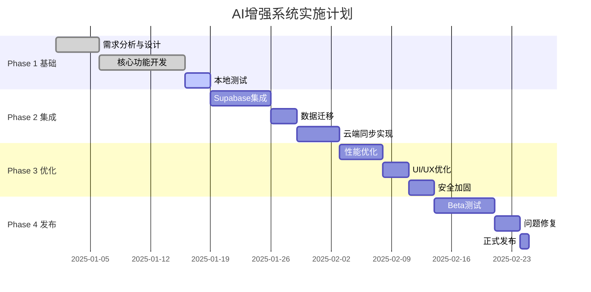

# 🛠️ Purple星语 - AI增强系统技术实施方案

> 版本：v1.0
> 更新日期：2025-01-10
> 文档类型：技术方案
> 技术负责人：[待定]

## 📋 目录

1. [技术概览](#技术概览)
2. [实施阶段](#实施阶段)
3. [详细实施方案](#详细实施方案)
4. [技术架构设计](#技术架构设计)
5. [数据库集成](#数据库集成)
6. [API设计](#api设计)
7. [性能优化](#性能优化)
8. [测试方案](#测试方案)
9. [部署方案](#部署方案)
10. [监控与维护](#监控与维护)

---

## 一、技术概览

### 1.1 技术栈

| 层级 | 技术选型 | 版本 | 说明 |
|-----|---------|------|------|
| **客户端** |  |  |  |
| iOS开发 | SwiftUI | 5.0+ | 声明式UI |
| 异步处理 | Swift Concurrency | async/await | 并发编程 |
| 网络请求 | URLSession | Native | 原生网络 |
| 本地存储 | UserDefaults + CoreData | - | 混合存储 |
| **后端服务** |  |  |  |
| 数据库 | Supabase (PostgreSQL) | 14+ | 云端数据库 |
| 实时同步 | Supabase Realtime | - | WebSocket |
| 认证 | Supabase Auth | - | JWT认证 |
| AI网关 | Vercel AI Gateway | - | 多模型路由 |
| **开发工具** |  |  |  |
| IDE | Xcode | 15+ | iOS开发 |
| 版本控制 | Git | - | 代码管理 |
| CI/CD | GitHub Actions | - | 自动化 |
| 监控 | Sentry | - | 错误追踪 |

### 1.2 技术挑战与解决方案

| 挑战 | 解决方案 | 技术细节 |
|-----|---------|---------|
| 实时性要求 | 本地缓存 + 异步更新 | UserDefaults快速读写 + 后台同步 |
| 网络不稳定 | 离线优先架构 | 本地队列 + 重试机制 |
| 数据一致性 | 乐观更新 + 冲突解决 | Version标记 + 合并策略 |
| 性能优化 | 懒加载 + 分页 | SwiftUI LazyView + Pagination |
| 安全性 | 端到端加密 | CryptoKit + TLS 1.3 |

---

## 二、实施阶段

### 2.1 整体规划



### 2.2 阶段目标

| 阶段 | 时间 | 目标 | 交付物 | 验收标准 |
|-----|------|------|--------|---------|
| **Phase 1** | Week 1-2 | 核心功能 | 增强版AI本地运行 | 功能完整 |
| **Phase 2** | Week 3-4 | 云端集成 | Supabase数据同步 | 数据一致 |
| **Phase 3** | Week 5-6 | 优化提升 | 性能和体验优化 | 指标达标 |
| **Phase 4** | Week 7-8 | 发布上线 | App Store发布 | 用户可用 |

---

## 三、详细实施方案

### 3.1 Phase 1: 基础功能实现（已完成）

#### ✅ 已完成项目

**1. EnhancedAIService核心实现**
```swift
// 文件：PurpleM/Services/EnhancedAIService.swift
class EnhancedAIService: NSObject, ObservableObject {
    // ✅ 情绪检测
    private func detectEmotion(from message: String) -> UserEmotion
    
    // ✅ 场景识别  
    private func detectScene(from message: String) -> ConversationScene
    
    // ✅ 记忆管理
    struct UserMemory: Codable
    
    // ✅ Prompt构建
    private func buildEnhancedPrompt() -> String
}
```

**2. 设置页面与切换机制**
```swift
// 文件：PurpleM/SettingsView.swift
enum AIMode: String, CaseIterable {
    case standard = "标准版"
    case enhanced = "增强版"
}

class SettingsManager: ObservableObject {
    @Published var aiMode: AIMode
}
```

**3. ChatTab动态服务**
```swift
// 文件：PurpleM/ChatTab.swift
private var aiService: NSObject {
    switch settingsManager.aiMode {
    case .standard: return AIService.shared
    case .enhanced: return EnhancedAIService.shared
    }
}
```

### 3.2 Phase 2: Supabase集成（进行中）

#### 📝 实施步骤

**Step 1: 创建SupabaseManager (Day 1-2)**

```swift
// 新建文件：PurpleM/Services/SupabaseManager.swift
import Foundation
import Supabase

class SupabaseManager: ObservableObject {
    static let shared = SupabaseManager()
    let client: SupabaseClient
    
    private init() {
        client = SupabaseClient(
            supabaseURL: URL(string: SupabaseConfig.url)!,
            supabaseKey: SupabaseConfig.anonKey
        )
    }
    
    // MARK: - 会话管理
    func createChatSession(userId: String, type: String) async -> UUID? {
        let session = [
            "user_id": userId,
            "session_type": type,
            "model_preferences": ["mode": "enhanced"]
        ]
        
        let response = await client
            .from("chat_sessions")
            .insert(session)
            .select()
            .single()
            .execute()
        
        return response.data?.id
    }
    
    // MARK: - 消息保存
    func saveMessage(
        sessionId: UUID,
        userId: String,
        role: String,
        content: String,
        metadata: [String: Any]
    ) async {
        let message = [
            "session_id": sessionId,
            "user_id": userId,
            "role": role,
            "content": content,
            "metadata": metadata
        ]
        
        await client
            .from("chat_messages")
            .insert(message)
            .execute()
    }
    
    // MARK: - 配额检查
    func checkQuota(userId: String) async -> QuotaStatus {
        let response = await client
            .rpc("get_user_daily_usage", params: ["p_user_id": userId])
            .execute()
        
        // 返回配额状态
        return QuotaStatus(from: response.data)
    }
    
    // MARK: - 知识库搜索
    func searchKnowledge(query: String) async -> [KnowledgeItem] {
        let response = await client
            .rpc("search_knowledge", params: ["query": query])
            .execute()
        
        return response.data?.compactMap { KnowledgeItem(from: $0) } ?? []
    }
}
```

**Step 2: 扩展EnhancedAIService (Day 3-4)**

```swift
// 文件：PurpleM/Services/EnhancedAIService+Supabase.swift
extension EnhancedAIService {
    
    // MARK: - 初始化时加载云端数据
    func initializeFromCloud() async {
        guard let userId = AuthManager.shared.currentUser?.id else { return }
        
        // 1. 加载用户偏好
        await loadUserPreferences(userId: userId)
        
        // 2. 加载历史记忆
        await loadUserMemory(userId: userId)
        
        // 3. 加载最近对话
        await loadRecentConversations(userId: userId)
    }
    
    // MARK: - 发送消息增强版
    func sendMessageWithCloud(_ message: String) async -> String {
        // 1. 创建或获取会话
        let sessionId = await getOrCreateSession()
        
        // 2. 检查配额
        guard await checkUserQuota() else {
            return "您的今日配额已用完，请升级订阅或明天再来～"
        }
        
        // 3. 情绪和场景检测
        let emotion = detectEmotion(from: message)
        let scene = detectScene(from: message)
        
        // 4. 搜索知识库增强
        let knowledge = await searchRelevantKnowledge(message)
        
        // 5. 构建增强Prompt
        let prompt = buildEnhancedPrompt(
            message: message,
            emotion: emotion,
            scene: scene,
            knowledge: knowledge
        )
        
        // 6. 调用AI
        let response = await callAIAPI(prompt: prompt)
        
        // 7. 保存到云端
        await saveToCloud(
            sessionId: sessionId,
            userMessage: message,
            aiResponse: response,
            metadata: [
                "emotion": emotion.rawValue,
                "scene": scene.rawValue
            ]
        )
        
        // 8. 更新本地缓存
        updateLocalCache(message: message, response: response)
        
        return response
    }
    
    // MARK: - 记忆同步
    func syncMemory() async {
        guard let userId = AuthManager.shared.currentUser?.id else { return }
        
        // 准备记忆数据
        let memoryData = [
            "key_events": userMemory.keyEvents,
            "concerns": userMemory.concerns,
            "preferences": userMemory.preferences
        ]
        
        // 更新到user_ai_preferences
        await SupabaseManager.shared.client
            .from("user_ai_preferences")
            .upsert([
                "user_id": userId,
                "custom_personality": memoryData
            ])
            .execute()
    }
}
```

**Step 3: 实现离线队列 (Day 5)**

```swift
// 文件：PurpleM/Services/OfflineQueue.swift
class OfflineQueue {
    static let shared = OfflineQueue()
    private var pendingOperations: [PendingOperation] = []
    
    struct PendingOperation: Codable {
        let id: UUID
        let type: OperationType
        let data: Data
        let timestamp: Date
        var retryCount: Int = 0
    }
    
    enum OperationType: String, Codable {
        case saveMessage
        case updateMemory
        case syncPreferences
    }
    
    // 添加操作到队列
    func enqueue(_ operation: PendingOperation) {
        pendingOperations.append(operation)
        saveQueue()
    }
    
    // 处理队列
    func processQueue() async {
        guard NetworkMonitor.shared.isConnected else { return }
        
        for operation in pendingOperations {
            let success = await processOperation(operation)
            if success {
                removeOperation(operation.id)
            } else {
                incrementRetry(operation.id)
            }
        }
    }
    
    // 网络恢复时自动处理
    func startMonitoring() {
        NetworkMonitor.shared.startMonitoring { isConnected in
            if isConnected {
                Task {
                    await self.processQueue()
                }
            }
        }
    }
}
```

**Step 4: 实时订阅实现 (Day 6-7)**

```swift
// 文件：PurpleM/Services/RealtimeManager.swift
class RealtimeManager {
    private var channel: RealtimeChannel?
    
    func subscribeToUserMessages(userId: String) {
        channel = SupabaseManager.shared.client
            .channel("user-messages")
            .on("postgres_changes",
                filter: ChannelFilter(
                    event: .insert,
                    schema: "public",
                    table: "chat_messages",
                    filter: "user_id=eq.\(userId)"
                )
            ) { [weak self] payload in
                self?.handleNewMessage(payload)
            }
        
        Task {
            await channel?.subscribe()
        }
    }
    
    private func handleNewMessage(_ payload: [String: Any]) {
        // 处理新消息
        NotificationCenter.default.post(
            name: .newMessageReceived,
            object: payload
        )
    }
    
    func unsubscribe() {
        Task {
            await channel?.unsubscribe()
        }
    }
}
```

### 3.3 Phase 3: 性能优化

#### 🚀 优化策略

**1. 缓存优化**

```swift
// 文件：PurpleM/Services/CacheManager.swift
class CacheManager {
    static let shared = CacheManager()
    private let cache = NSCache<NSString, CacheItem>()
    
    class CacheItem: NSObject {
        let data: Any
        let timestamp: Date
        let ttl: TimeInterval
        
        var isExpired: Bool {
            Date().timeIntervalSince(timestamp) > ttl
        }
    }
    
    // 三级缓存策略
    func get<T>(key: String, type: T.Type) async -> T? {
        // L1: 内存缓存
        if let cached = cache.object(forKey: key as NSString),
           !cached.isExpired,
           let data = cached.data as? T {
            return data
        }
        
        // L2: 本地存储
        if let localData = UserDefaults.standard.object(forKey: key) as? T {
            cache.setObject(CacheItem(data: localData), forKey: key as NSString)
            return localData
        }
        
        // L3: 云端获取
        let cloudData = await fetchFromCloud(key: key, type: type)
        if let data = cloudData {
            set(key: key, value: data, ttl: 300) // 5分钟缓存
        }
        return cloudData
    }
    
    func set<T>(key: String, value: T, ttl: TimeInterval = 300) {
        let item = CacheItem(data: value, timestamp: Date(), ttl: ttl)
        cache.setObject(item, forKey: key as NSString)
        UserDefaults.standard.set(value, forKey: key)
    }
}
```

**2. 异步加载优化**

```swift
// 文件：PurpleM/ChatTab.swift
struct ChatTab: View {
    @State private var isInitializing = true
    
    var body: some View {
        Group {
            if isInitializing {
                LoadingView()
                    .task {
                        await initializeAI()
                    }
            } else {
                ChatContentView()
            }
        }
    }
    
    private func initializeAI() async {
        // 并行加载
        async let preferences = loadPreferences()
        async let history = loadHistory()
        async let knowledge = preloadKnowledge()
        
        await (preferences, history, knowledge)
        
        await MainActor.run {
            isInitializing = false
        }
    }
}
```

**3. 响应优化**

```swift
// 预测性加载
class PredictiveLoader {
    func preloadSuggestions(for emotion: UserEmotion) async {
        // 基于情绪预加载可能的回复模板
        let templates = await fetchTemplates(for: emotion)
        CacheManager.shared.set(
            key: "templates_\(emotion.rawValue)",
            value: templates
        )
    }
    
    func prefetchKnowledge(keywords: [String]) async {
        // 预取可能需要的知识
        for keyword in keywords {
            async let knowledge = searchKnowledge(keyword)
            await CacheManager.shared.set(
                key: "knowledge_\(keyword)",
                value: knowledge
            )
        }
    }
}
```

### 3.4 Phase 4: 测试与发布

#### 🧪 测试策略

**1. 单元测试**

```swift
// 文件：PurpleMTests/EnhancedAIServiceTests.swift
import XCTest
@testable import PurpleM

class EnhancedAIServiceTests: XCTestCase {
    
    func testEmotionDetection() {
        let service = EnhancedAIService.shared
        
        // 测试情绪识别
        XCTAssertEqual(
            service.detectEmotion(from: "我好焦虑"),
            .anxious
        )
        XCTAssertEqual(
            service.detectEmotion(from: "太开心了！"),
            .excited
        )
    }
    
    func testSceneDetection() {
        let service = EnhancedAIService.shared
        
        // 测试场景识别
        XCTAssertEqual(
            service.detectScene(from: "我的命盘怎么样"),
            .chartReading
        )
        XCTAssertEqual(
            service.detectScene(from: "什么是紫微斗数"),
            .learning
        )
    }
    
    func testMemoryPersistence() async {
        let service = EnhancedAIService.shared
        
        // 添加记忆
        service.userMemory.remember(event: "测试事件", importance: 5)
        
        // 保存并重新加载
        await service.syncMemory()
        await service.loadMemoryFromCloud()
        
        // 验证持久化
        XCTAssertTrue(
            service.userMemory.keyEvents.contains { $0.event == "测试事件" }
        )
    }
}
```

**2. 集成测试**

```swift
// 文件：PurpleMTests/IntegrationTests.swift
class IntegrationTests: XCTestCase {
    
    func testEndToEndConversation() async {
        // 1. 用户登录
        let authSuccess = await AuthManager.shared.signIn(
            email: "test@example.com",
            password: "testpass"
        )
        XCTAssertTrue(authSuccess)
        
        // 2. 发送消息
        let response = await EnhancedAIService.shared
            .sendMessageWithCloud("我最近很焦虑")
        
        // 3. 验证响应
        XCTAssertTrue(response.contains("理解") || response.contains("感受"))
        
        // 4. 检查云端保存
        let messages = await fetchUserMessages()
        XCTAssertFalse(messages.isEmpty)
    }
}
```

**3. 性能测试**

```swift
// 文件：PurpleMTests/PerformanceTests.swift
class PerformanceTests: XCTestCase {
    
    func testResponseTime() {
        measure {
            let expectation = XCTestExpectation()
            
            Task {
                let start = Date()
                _ = await EnhancedAIService.shared.sendMessage("测试消息")
                let elapsed = Date().timeIntervalSince(start)
                
                XCTAssertLessThan(elapsed, 2.0) // < 2秒
                expectation.fulfill()
            }
            
            wait(for: [expectation], timeout: 5)
        }
    }
    
    func testMemoryUsage() {
        // 监控内存使用
        let baseline = getMemoryUsage()
        
        // 执行大量操作
        for _ in 0..<100 {
            _ = EnhancedAIService.shared.detectEmotion(from: "测试")
        }
        
        let peak = getMemoryUsage()
        XCTAssertLessThan(peak - baseline, 10 * 1024 * 1024) // < 10MB
    }
}
```

---

## 四、技术架构设计

### 4.1 分层架构

```
┌────────────────────────────────────┐
│         Presentation Layer          │
│   SwiftUI Views & ViewModels        │
├────────────────────────────────────┤
│          Service Layer              │
│   Business Logic & Orchestration    │
├────────────────────────────────────┤
│           Data Layer                │
│   Repositories & Data Sources       │
├────────────────────────────────────┤
│        Infrastructure Layer         │
│   Network, Cache, Storage           │
└────────────────────────────────────┘
```

### 4.2 模块设计

```swift
// MARK: - 依赖注入容器
class DIContainer {
    static let shared = DIContainer()
    
    lazy var aiService: AIServiceProtocol = {
        if SettingsManager.shared.aiMode == .enhanced {
            return EnhancedAIService.shared
        }
        return AIService.shared
    }()
    
    lazy var supabaseManager = SupabaseManager.shared
    lazy var cacheManager = CacheManager.shared
    lazy var offlineQueue = OfflineQueue.shared
}

// MARK: - 协议定义
protocol AIServiceProtocol {
    func sendMessage(_ message: String) async -> String
    func resetConversation()
}

// MARK: - Repository模式
class ChatRepository {
    private let remote: SupabaseManager
    private let local: CacheManager
    private let queue: OfflineQueue
    
    func saveMessage(_ message: ChatMessage) async {
        // 本地保存
        local.set(key: message.id, value: message)
        
        // 尝试远程保存
        if NetworkMonitor.shared.isConnected {
            await remote.saveMessage(message)
        } else {
            // 加入离线队列
            queue.enqueue(
                PendingOperation(
                    type: .saveMessage,
                    data: message.encoded()
                )
            )
        }
    }
}
```

---

## 五、数据库集成

### 5.1 数据模型映射

```swift
// MARK: - Swift模型定义
struct ChatSession: Codable {
    let id: UUID
    let userId: UUID
    let title: String?
    let sessionType: String
    let modelPreferences: [String: Any]?
    let createdAt: Date
    let updatedAt: Date
}

struct ChatMessage: Codable {
    let id: UUID
    let sessionId: UUID
    let userId: UUID
    let role: MessageRole
    let content: String
    let metadata: MessageMetadata?
    let createdAt: Date
}

struct MessageMetadata: Codable {
    let emotion: String?
    let scene: String?
    let suggestedQuestions: [String]?
    let confidence: Double?
}

// MARK: - 数据转换
extension ChatMessage {
    func toSupabaseRow() -> [String: Any] {
        return [
            "id": id.uuidString,
            "session_id": sessionId.uuidString,
            "user_id": userId.uuidString,
            "role": role.rawValue,
            "content": content,
            "metadata": metadata?.toDictionary() ?? [:],
            "created_at": createdAt.ISO8601Format()
        ]
    }
    
    static func fromSupabaseRow(_ row: [String: Any]) -> ChatMessage? {
        // 解析逻辑
        guard let id = UUID(uuidString: row["id"] as? String ?? ""),
              let sessionId = UUID(uuidString: row["session_id"] as? String ?? ""),
              // ... 其他字段
        else { return nil }
        
        return ChatMessage(/*...*/)
    }
}
```

### 5.2 迁移策略

```swift
// MARK: - 数据迁移管理器
class DataMigrationManager {
    
    func migrateToCloud() async throws {
        // 1. 检查迁移状态
        let migrationKey = "data_migration_completed"
        guard !UserDefaults.standard.bool(forKey: migrationKey) else {
            return // 已迁移
        }
        
        // 2. 读取本地数据
        let localMessages = loadLocalMessages()
        let localMemory = loadLocalMemory()
        
        // 3. 批量上传
        try await uploadBatch(messages: localMessages)
        try await uploadMemory(memory: localMemory)
        
        // 4. 验证完整性
        let cloudCount = await getCloudMessageCount()
        guard cloudCount == localMessages.count else {
            throw MigrationError.dataInconsistency
        }
        
        // 5. 标记完成
        UserDefaults.standard.set(true, forKey: migrationKey)
        
        // 6. 清理本地（可选）
        // cleanupLocalData()
    }
    
    private func uploadBatch<T: Encodable>(
        items: [T],
        tableName: String,
        batchSize: Int = 100
    ) async throws {
        for chunk in items.chunked(into: batchSize) {
            await SupabaseManager.shared.client
                .from(tableName)
                .insert(chunk)
                .execute()
        }
    }
}
```

---

## 六、API设计

### 6.1 RESTful API接口

```yaml
# API定义
openapi: 3.0.0
info:
  title: Purple AI Enhancement API
  version: 1.0.0

paths:
  /api/chat/send:
    post:
      summary: 发送消息
      requestBody:
        content:
          application/json:
            schema:
              type: object
              properties:
                sessionId: string
                message: string
                context: object
      responses:
        200:
          description: AI响应
          content:
            application/json:
              schema:
                type: object
                properties:
                  response: string
                  emotion: string
                  scene: string
                  suggestions: array

  /api/memory/sync:
    post:
      summary: 同步记忆
      requestBody:
        content:
          application/json:
            schema:
              $ref: '#/components/schemas/UserMemory'
      responses:
        200:
          description: 同步成功

  /api/knowledge/search:
    get:
      summary: 搜索知识库
      parameters:
        - name: query
          in: query
          schema:
            type: string
      responses:
        200:
          description: 搜索结果
          content:
            application/json:
              schema:
                type: array
                items:
                  $ref: '#/components/schemas/KnowledgeItem'
```

### 6.2 错误处理

```swift
// MARK: - 统一错误处理
enum AIServiceError: LocalizedError {
    case networkError(Error)
    case quotaExceeded
    case invalidResponse
    case authenticationFailed
    case serverError(code: Int, message: String)
    
    var errorDescription: String? {
        switch self {
        case .networkError(let error):
            return "网络连接失败：\(error.localizedDescription)"
        case .quotaExceeded:
            return "今日配额已用完，请升级订阅"
        case .invalidResponse:
            return "服务器响应异常，请稍后重试"
        case .authenticationFailed:
            return "认证失败，请重新登录"
        case .serverError(let code, let message):
            return "服务器错误(\(code))：\(message)"
        }
    }
    
    var recoverySuggestion: String? {
        switch self {
        case .networkError:
            return "请检查网络连接"
        case .quotaExceeded:
            return "升级到专业版获得更多配额"
        case .invalidResponse, .serverError:
            return "请稍后重试或联系客服"
        case .authenticationFailed:
            return "请重新登录账号"
        }
    }
}

// MARK: - 错误恢复
class ErrorRecovery {
    static func handle(_ error: AIServiceError) async -> RecoveryAction {
        switch error {
        case .networkError:
            return .retry(after: 2.0)
        case .quotaExceeded:
            return .showUpgrade
        case .authenticationFailed:
            return .reAuthenticate
        default:
            return .alert(error.localizedDescription)
        }
    }
}

enum RecoveryAction {
    case retry(after: TimeInterval)
    case showUpgrade
    case reAuthenticate
    case alert(String)
}
```

---

## 七、性能优化

### 7.1 性能指标

| 指标 | 目标值 | 测量方法 |
|-----|--------|---------|
| 首屏加载 | < 1s | Time to Interactive |
| API响应 | < 2s | P95延迟 |
| 内存占用 | < 100MB | Memory Profiler |
| CPU使用率 | < 30% | Instruments |
| 缓存命中率 | > 80% | Cache Analytics |

### 7.2 优化技术

```swift
// MARK: - 1. 懒加载优化
struct ChatView: View {
    @State private var visibleMessages: [ChatMessage] = []
    private let pageSize = 20
    
    var body: some View {
        ScrollView {
            LazyVStack {
                ForEach(visibleMessages) { message in
                    MessageBubble(message: message)
                        .onAppear {
                            loadMoreIfNeeded(message)
                        }
                }
            }
        }
    }
    
    func loadMoreIfNeeded(_ message: ChatMessage) {
        guard message == visibleMessages.last else { return }
        Task {
            await loadNextPage()
        }
    }
}

// MARK: - 2. 图片优化
class ImageCache {
    private let cache = NSCache<NSString, UIImage>()
    
    func loadImage(url: URL) async -> UIImage? {
        // 检查缓存
        if let cached = cache.object(forKey: url.absoluteString as NSString) {
            return cached
        }
        
        // 异步加载
        guard let (data, _) = try? await URLSession.shared.data(from: url),
              let image = UIImage(data: data) else {
            return nil
        }
        
        // 压缩并缓存
        let compressed = compress(image)
        cache.setObject(compressed, forKey: url.absoluteString as NSString)
        return compressed
    }
    
    private func compress(_ image: UIImage) -> UIImage {
        let maxSize: CGFloat = 1024
        let scale = min(maxSize / image.size.width, maxSize / image.size.height)
        if scale < 1 {
            let newSize = CGSize(
                width: image.size.width * scale,
                height: image.size.height * scale
            )
            return image.resized(to: newSize)
        }
        return image
    }
}

// MARK: - 3. 数据预取
class DataPrefetcher {
    func prefetchForScene(_ scene: ConversationScene) async {
        switch scene {
        case .chartReading:
            await prefetchChartData()
        case .fortuneTelling:
            await prefetchFortuneData()
        case .learning:
            await prefetchKnowledgeBase()
        default:
            break
        }
    }
    
    private func prefetchChartData() async {
        // 预加载星盘数据
        if let chart = await loadUserChart() {
            CacheManager.shared.set(key: "user_chart", value: chart)
        }
    }
}

// MARK: - 4. 批量操作
class BatchProcessor {
    private var pendingOperations: [Operation] = []
    private let batchSize = 10
    private let batchDelay: TimeInterval = 0.5
    
    func add(_ operation: Operation) {
        pendingOperations.append(operation)
        
        if pendingOperations.count >= batchSize {
            processBatch()
        } else {
            scheduleBatch()
        }
    }
    
    private func scheduleBatch() {
        Timer.scheduledTimer(withTimeInterval: batchDelay, repeats: false) { _ in
            self.processBatch()
        }
    }
    
    private func processBatch() {
        guard !pendingOperations.isEmpty else { return }
        
        let batch = pendingOperations
        pendingOperations.removeAll()
        
        Task {
            await processOperations(batch)
        }
    }
}
```

---

## 八、测试方案

### 8.1 测试覆盖率目标

| 测试类型 | 覆盖率目标 | 当前状态 |
|---------|-----------|---------|
| 单元测试 | > 80% | 待实施 |
| 集成测试 | > 60% | 待实施 |
| UI测试 | > 40% | 待实施 |
| 端到端测试 | 核心流程100% | 待实施 |

### 8.2 测试用例设计

```swift
// MARK: - 测试用例清单
enum TestCase {
    // 情绪识别测试
    static let emotionCases = [
        ("我好焦虑啊", UserEmotion.anxious),
        ("太开心了！", UserEmotion.excited),
        ("为什么会这样？", UserEmotion.curious),
        ("好难过", UserEmotion.sad),
        ("真烦人", UserEmotion.angry),
        ("今天天气不错", UserEmotion.neutral)
    ]
    
    // 场景识别测试
    static let sceneCases = [
        ("看看我的命盘", ConversationScene.chartReading),
        ("今年运势如何", ConversationScene.fortuneTelling),
        ("什么是紫微斗数", ConversationScene.learning),
        ("我该怎么办", ConversationScene.counseling),
        ("你好", ConversationScene.greeting)
    ]
    
    // 边界测试
    static let edgeCases = [
        "", // 空消息
        String(repeating: "测", count: 10000), // 超长消息
        "😀🎉🌟", // 纯表情
        "<script>alert('test')</script>", // XSS测试
        "'; DROP TABLE users; --" // SQL注入测试
    ]
}

// MARK: - 自动化测试
class AutomatedTestRunner {
    func runAllTests() async -> TestReport {
        var results: [TestResult] = []
        
        // 运行各类测试
        results += await runEmotionTests()
        results += await runSceneTests()
        results += await runEdgeTests()
        results += await runPerformanceTests()
        results += await runSecurityTests()
        
        return TestReport(results: results)
    }
    
    private func runEmotionTests() async -> [TestResult] {
        var results: [TestResult] = []
        
        for (input, expected) in TestCase.emotionCases {
            let actual = EnhancedAIService.shared.detectEmotion(from: input)
            results.append(
                TestResult(
                    name: "Emotion: \(input)",
                    passed: actual == expected,
                    message: "Expected \(expected), got \(actual)"
                )
            )
        }
        
        return results
    }
}
```

### 8.3 压力测试

```swift
// MARK: - 压力测试
class StressTest {
    func testConcurrentUsers(count: Int) async {
        let group = TaskGroup<TimeInterval>()
        
        for i in 0..<count {
            group.addTask {
                let start = Date()
                _ = await self.simulateUserSession(userId: "user_\(i)")
                return Date().timeIntervalSince(start)
            }
        }
        
        var responseTimes: [TimeInterval] = []
        for await time in group {
            responseTimes.append(time)
        }
        
        // 分析结果
        let p50 = percentile(responseTimes, 0.5)
        let p95 = percentile(responseTimes, 0.95)
        let p99 = percentile(responseTimes, 0.99)
        
        print("Stress Test Results:")
        print("P50: \(p50)s")
        print("P95: \(p95)s")
        print("P99: \(p99)s")
    }
    
    private func simulateUserSession(userId: String) async {
        // 模拟真实用户行为
        for _ in 0..<10 {
            _ = await EnhancedAIService.shared.sendMessage(
                TestCase.emotionCases.randomElement()!.0
            )
            
            // 模拟思考时间
            try? await Task.sleep(nanoseconds: UInt64.random(in: 1...3) * 1_000_000_000)
        }
    }
}
```

---

## 九、部署方案

### 9.1 CI/CD流程

```yaml
# .github/workflows/deploy.yml
name: Deploy to App Store

on:
  push:
    tags:
      - 'v*'

jobs:
  test:
    runs-on: macos-latest
    steps:
      - uses: actions/checkout@v3
      
      - name: Run Tests
        run: |
          xcodebuild test \
            -project PurpleM.xcodeproj \
            -scheme PurpleM \
            -destination 'platform=iOS Simulator,name=iPhone 14'
      
      - name: Generate Coverage Report
        run: |
          xcov --project PurpleM.xcodeproj \
               --scheme PurpleM \
               --output_directory coverage_report

  build:
    needs: test
    runs-on: macos-latest
    steps:
      - uses: actions/checkout@v3
      
      - name: Build Archive
        run: |
          xcodebuild archive \
            -project PurpleM.xcodeproj \
            -scheme PurpleM \
            -archivePath build/PurpleM.xcarchive
      
      - name: Export IPA
        run: |
          xcodebuild -exportArchive \
            -archivePath build/PurpleM.xcarchive \
            -exportPath build \
            -exportOptionsPlist ExportOptions.plist

  deploy:
    needs: build
    runs-on: macos-latest
    steps:
      - name: Upload to TestFlight
        run: |
          xcrun altool --upload-app \
            -f build/PurpleM.ipa \
            -u ${{ secrets.APPLE_ID }} \
            -p ${{ secrets.APP_PASSWORD }}
      
      - name: Notify Team
        run: |
          curl -X POST ${{ secrets.SLACK_WEBHOOK }} \
            -H 'Content-Type: application/json' \
            -d '{"text":"🚀 PurpleM ${{ github.ref }} deployed to TestFlight"}'
```

### 9.2 版本管理

```swift
// MARK: - 版本控制
struct AppVersion {
    static let current = "1.1.0"
    static let build = Bundle.main.infoDictionary?["CFBundleVersion"] as? String ?? "1"
    
    static var userAgent: String {
        "PurpleM/\(current) (iOS; Build/\(build))"
    }
    
    static func checkForUpdate() async -> UpdateInfo? {
        // 检查更新
        let response = await fetchLatestVersion()
        
        if let latest = response?.version,
           compareVersions(current, latest) < 0 {
            return UpdateInfo(
                version: latest,
                releaseNotes: response?.releaseNotes ?? "",
                isMandatory: response?.mandatory ?? false
            )
        }
        
        return nil
    }
}

// MARK: - 功能开关
struct FeatureFlags {
    static let shared = FeatureFlags()
    
    private let flags: [String: Bool] = [
        "enhanced_ai": true,
        "cloud_sync": true,
        "realtime_sync": false, // 待测试
        "voice_input": false,   // 开发中
        "ar_features": false    // 未来功能
    ]
    
    func isEnabled(_ feature: String) -> Bool {
        #if DEBUG
        // 开发环境全部开启
        return true
        #else
        return flags[feature] ?? false
        #endif
    }
}
```

### 9.3 监控配置

```swift
// MARK: - Sentry配置
class MonitoringService {
    static func initialize() {
        SentrySDK.start { options in
            options.dsn = Config.sentryDSN
            options.environment = Config.environment
            options.tracesSampleRate = Config.isDevelopment ? 1.0 : 0.1
            options.attachScreenshot = true
            options.attachViewHierarchy = true
            
            // 性能监控
            options.enableAutoPerformanceTracking = true
            options.enableUIViewControllerTracking = true
            options.enableNetworkTracking = true
            options.enableCoreDataTracking = true
        }
    }
    
    static func trackEvent(_ event: String, properties: [String: Any]? = nil) {
        SentrySDK.capture(message: event) { scope in
            scope.setContext("properties", value: properties ?? [:])
        }
    }
    
    static func trackError(_ error: Error, context: [String: Any]? = nil) {
        SentrySDK.capture(error: error) { scope in
            scope.setContext("error_context", value: context ?? [:])
        }
    }
}

// MARK: - 自定义指标
extension MonitoringService {
    static func trackAIMetrics(
        responseTime: TimeInterval,
        emotion: UserEmotion,
        scene: ConversationScene,
        tokensUsed: Int
    ) {
        let transaction = SentrySDK.startTransaction(
            name: "ai_response",
            operation: "ai.chat"
        )
        
        transaction.setData(value: responseTime, key: "response_time")
        transaction.setData(value: emotion.rawValue, key: "emotion")
        transaction.setData(value: scene.rawValue, key: "scene")
        transaction.setData(value: tokensUsed, key: "tokens")
        
        transaction.finish()
    }
}
```

---

## 十、监控与维护

### 10.1 监控指标

| 类别 | 指标 | 告警阈值 | 响应级别 |
|-----|------|---------|---------|
| **可用性** |  |  |  |
| API可用率 | < 99.9% | P1 | 立即响应 |
| 错误率 | > 1% | P2 | 1小时内 |
| **性能** |  |  |  |
| API延迟P95 | > 3s | P2 | 1小时内 |
| API延迟P99 | > 5s | P3 | 24小时内 |
| **业务** |  |  |  |
| 日活跃用户 | < 预期80% | P3 | 24小时内 |
| 付费转化率 | < 3% | P3 | 周度检查 |
| **资源** |  |  |  |
| 数据库连接 | > 80% | P2 | 1小时内 |
| API配额 | > 90% | P2 | 1小时内 |

### 10.2 运维手册

```markdown
# 运维手册

## 常见问题处理

### 1. API响应缓慢
- 检查Vercel状态页
- 检查Supabase连接池
- 查看缓存命中率
- 考虑降级到标准版

### 2. 用户无法登录
- 检查Auth服务状态
- 验证JWT配置
- 查看错误日志
- 清除用户缓存

### 3. 数据同步失败
- 检查网络连接
- 验证Supabase凭证
- 查看离线队列
- 手动触发同步

## 紧急联系人
- 技术负责人: [电话]
- 产品负责人: [电话]
- 云服务支持: [电话]
```

### 10.3 维护计划

| 维护类型 | 频率 | 时间窗口 | 影响范围 |
|---------|------|---------|---------|
| 日常维护 | 每日 | 凌晨2-3点 | 无影响 |
| 版本更新 | 双周 | 周二凌晨 | 5分钟 |
| 数据备份 | 每日 | 凌晨1点 | 无影响 |
| 安全更新 | 按需 | 紧急窗口 | 视情况 |
| 大版本升级 | 季度 | 周末凌晨 | 2小时 |

---

## 附录

### A. 代码规范

```swift
// MARK: - 命名规范
// 类型：UpperCamelCase
class EnhancedAIService { }
struct UserMemory { }
enum ConversationScene { }

// 属性/方法：lowerCamelCase
var currentScene: ConversationScene
func detectEmotion(from message: String) -> UserEmotion

// 常量：lowerCamelCase或UPPER_SNAKE_CASE
let maxRetryCount = 3
let API_TIMEOUT = 30.0

// MARK: - 注释规范
/// 检测用户情绪
/// - Parameter message: 用户消息
/// - Returns: 识别出的情绪类型
func detectEmotion(from message: String) -> UserEmotion {
    // 实现细节...
}

// MARK: - 代码组织
// 使用MARK注释分组
// 按功能模块组织文件
// 每个文件不超过400行
```

### B. Git工作流

```bash
# 分支策略
main          # 生产环境
├── develop   # 开发环境
    ├── feature/enhanced-ai    # 功能分支
    ├── feature/cloud-sync     # 功能分支
    └── hotfix/crash-fix       # 紧急修复

# 提交规范
feat: 添加情绪识别功能
fix: 修复内存泄漏问题
docs: 更新API文档
style: 代码格式优化
refactor: 重构缓存管理器
test: 添加单元测试
chore: 更新依赖版本
```

### C. 依赖管理

```swift
// Package.swift
dependencies: [
    .package(url: "https://github.com/supabase/supabase-swift", from: "0.3.0"),
    .package(url: "https://github.com/getsentry/sentry-cocoa", from: "8.0.0"),
    .package(url: "https://github.com/Alamofire/Alamofire", from: "5.6.0")
]
```

### D. 安全检查清单

- [ ] API密钥使用环境变量
- [ ] 敏感数据加密存储
- [ ] HTTPS强制使用
- [ ] 证书固定实施
- [ ] SQL注入防护
- [ ] XSS防护
- [ ] 用户输入验证
- [ ] 权限最小化原则
- [ ] 日志脱敏处理
- [ ] 定期安全审计

---

## 文档更新记录

| 版本 | 日期 | 更新内容 | 作者 |
|-----|------|---------|------|
| v1.0 | 2025-01-10 | 初始版本 | System |

---

*本文档为Purple星语AI增强系统的技术实施指南，请严格按照文档执行实施。*

*技术支持：[联系方式]*